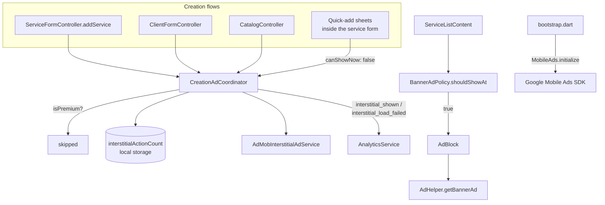

# Ads

Two ad formats, one rule that governs both: **a premium user never sees an ad.**
The single check is `isPremiumProvider`; neither policy object below queries the
subscription service directly.

| | Interstitial | Banner |
|---|---|---|
| Format | Full-screen, dismissible | `AdSize.largeBanner` (320×100) |
| Trigger | After a successful creation | Inline in the service list |
| Rule object | [`CreationAdCoordinator`](creation_ad_coordinator.dart) | [`BannerAdPolicy`](banner_ad_policy.dart) |
| Rate | Every **3** creation actions | Every **3** list items |
| Remote Config key | `interstitial_ad_frequency` | `banner_ad_frequency` |
| Ad unit (`.env.<flavor>`) | `SERVICE_CREATE_ANDROID` / `_IOS` | `SERVICE_LIST_ANDROID` / `_IOS` |

Both rates are read from Firebase Remote Config and fall back to a code default
of **3** when the key is unset, non-numeric, or `<= 0`. Both defaults are also
declared in `RemoteConfigKeys.defaults` — Remote Config's `setDefaults` replaces
its map wholesale, so a key missing there is a key that reads as zero.

---

## Where the pieces live

| File | Role |
|---|---|
| [`creation_ad_coordinator.dart`](creation_ad_coordinator.dart) | Counts creation actions, decides when the interstitial shows |
| [`banner_ad_policy.dart`](banner_ad_policy.dart) | Pure `shouldShowAt(index)` |
| [`admob_interstitial_ad_service.dart`](admob_interstitial_ad_service.dart) | Preload / show / re-preload lifecycle |
| [`../../domain/interstitial_ad_service.dart`](../../domain/interstitial_ad_service.dart) | The interface both the app and the tests speak to |
| [`core/widgets/ads/ad_block.dart`](../../../widgets/ads/ad_block.dart) | Owns one `BannerAd` per mounted list row |
| [`core/utils/ad_helper.dart`](../../../utils/ad_helper.dart) | Builds the `BannerAd` and its listener |
| [`injector.dart`](../../../../injector.dart) | Wires all three as `keepAlive` providers |

---

## Interstitial

A **creation action** is one successful write of a client, a catalog item, or a
service. Each one increments a counter persisted in local storage
(`interstitialActionCount`); the ad shows once that counter reaches the
frequency.

Three details that are easy to get wrong when touching this:

- **Quick-adds count but never interrupt.** The client and catalog-item sheets
  inside the service form call `onCreationAction(canShowNow: false)` — the user
  is mid-form, and a full-screen ad there loses their input. The action still
  increments, so it counts toward the next eligible show.
- **The counter only resets when an ad actually rendered.** `showIfAvailable()`
  returns `false` when nothing is preloaded; the count is kept so the next
  eligible action retries instead of waiting a full cycle.
- **Nothing here can fail a creation.** The whole body is wrapped — a storage
  error, a Remote Config error, or an SDK error is logged and swallowed. The
  service the user just saved is already saved.

`AdMobInterstitialAdService` preloads eagerly (at provider construction) and
re-preloads on dismissal or show-failure. It detaches `_ad` before calling
`show()`, so two concurrent calls cannot show the same ad twice.

Both outcomes are reported to analytics as `interstitial_shown` /
`interstitial_load_failed` — deliberately from the coordinator rather than from
the SDK callbacks, because the question being answered is about the app (how
much advertising a free user actually absorbs per session), and a failed load is
half of that answer.

### Effective rate

The counter is shared across all three creation types, so the interstitial is
**not** "every 3 services" — it is every 3 creations of any kind. A user adding
a client, a catalog item and then a service sees it on the service.

---

## Banner

`shouldShowAt(index)` is `!isPremium && index != 0 && index % frequency == 0` —
so at list positions 3, 6, 9, … Position 0 is excluded so the first thing on the
screen is never an ad.

`AdBlock` **owns the ad's lifecycle**: one `BannerAd` is created and loaded in
`initState` and disposed in `dispose`. This is not incidental. Building the ad
inside `build()` — as an earlier version did — issues a fresh ad request every
time the row scrolls back into view and leaks every ad it replaces. AdMob reads
that pattern as invalid traffic.

The block renders **nothing** until `onAdLoaded` fires: an empty slot with a
divider reads as a broken row, and reserving height for an ad that never arrives
is dead space in the list. The `SizedBox` takes its dimensions from `ad.size`,
never a hard-coded height — a container smaller than the creative makes the SDK
refuse to render it.

### Side effect worth knowing

A row that carries a banner is wrapped in `AdBlock` instead of `Dismissible`, so
**that row loses swipe-to-toggle**. The action is still reachable by opening the
service. Changing this means nesting the two, not swapping them.

---

## Setup outside the code

| | Android | iOS |
|---|---|---|
| App id | `ADMOB_APPID` in `key.properties`, injected as a `resValue` per build type, read by `AndroidManifest.xml` | **Not configured** — no `GADApplicationIdentifier` in `Info.plist` |
| Ad units | `.env.<flavor>` | `.env.<flavor>` |
| SKAdNetwork | n/a | **Not configured** |

The `prod_test` flavor exists precisely so production configuration can be run
against test ad units; its `.env.prod_test` carries Google's test unit ids.

`TEST_DEVICE_IDS` is a comma-separated list of AdMob device ids, applied by
`_initializeAds` in [`bootstrap.dart`](../../../bootstrap.dart) via
`updateRequestConfiguration` **before** `MobileAds.instance.initialize()`. Those
devices are served Google's test creatives on every unit, real ad units
included, so exercising creation flows on a dev device is not counted as real
traffic.

Get the id from logcat/Xcode on the first ad request — the SDK prints
`Use RequestConfiguration.Builder().setTestDeviceIds(...)` with the hash — and
add it to each `.env.*` you run on. An empty or absent value means every request
from that build is real; that is what the `prod_test` flavor is the fallback
for.

---

## Testing

`BannerAdPolicy` and `CreationAdCoordinator` are pure enough to unit-test
directly ([`test/lib/core/services/data/ads/`](../../../../../test/lib/core/services/data/ads)) —
that is the reason the rules are objects rather than `if`s inside widgets. The
SDK-facing halves (`AdMobInterstitialAdService`, `AdBlock`) are not covered:
they need a real `MobileAds` binding.
