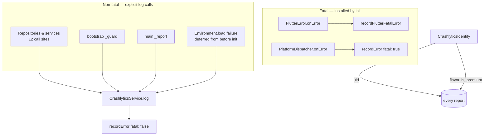

# Crashlytics

One question: **when this broke for a real user, what was the app doing and who
was it?** Analytics answers where people go; this answers what stopped them.

| | |
|---|---|
| Interface | [`CrashlyticsService`](../../domain/crashlytics_service.dart) — 4 methods |
| Implementation | [`firebase_crashlytics_service.dart`](firebase_crashlytics_service.dart) |
| Identity | [`crashlytics_identity.dart`](crashlytics_identity.dart) |
| Provider | `crashlyticsServiceProvider` (`keepAlive`) in [`injector.dart`](../../../../injector.dart) |
| Started | [`main.dart`](../../../../main.dart), first thing after Firebase |

---

## What reaches the dashboard

`init()` is awaited **before** anything else in `main()` for exactly one reason:
it is what reports a failure in everything after it. See [core/README.md](../../../README.md).

---

## Collection is off in debug

`FirebaseCrashlyticsService` takes `isCollectionEnabled`, defaulting to
`!kDebugMode`. Two consequences, and the second is the one that bites:

- A crash on a developer's machine never reaches the dashboard. `prod` and
  `prod_test` share **one Firebase project**, so there is no separate bucket it
  could have landed in.
- When collection is off, `init()` **returns without touching**
  `FlutterError.onError` or `PlatformDispatcher.onError`. Overriding them would
  hand every debug error to a disabled collector, which drops it — and the
  console output is the entire point of a debug run. Leaving Flutter's own
  handlers in place is deliberate, not an oversight.

Pass the flag explicitly to test either branch.

---

## Every report carries who and which build

[`CrashlyticsIdentity`](crashlytics_identity.dart) is a `keepAlive` controller
started first in the bootstrap — before the ads SDK, before Remote Config —
because a crash in any of those steps should already be attributable.

| Stamp | Value | Why |
|---|---|---|
| User id | Firebase Auth uid, cleared on sign-out | Same id analytics uses as `distinctId`, so a crash and a funnel drop-off match to one person |
| `flavor` | `staging` / `prod` / `prod_test` | `prod` and `prod_test` report into the same project; without this an internal build's crash looks like a user's |
| `is_premium` | bool | Separates the paying cohort's crashes from the ad-serving code paths |

It is kept **separate from `AnalyticsIdentityController`** despite the overlap:
that one describes cohorts and is gated behind the user's analytics consent,
this one is diagnostic and is not.

---

## The startup window nothing could report

Crashlytics needs Firebase; Firebase needs the environment. Anything failing
before `init()` therefore has no reporter yet. Two halves:

- **`Environment.load()`** — its failure is *captured and deferred*, not thrown.
  The app runs without dotenv (every key resolves to empty), so it continues
  degraded and `main()` reports the error as soon as Crashlytics is up.
- **`FirebaseWrapper.initialize()`** — genuinely unreportable. If Firebase does
  not come up there is no Crashlytics to receive the error, native or Dart. It
  still rethrows, and that startup crash is invisible by construction.

Everything after `init()` in `main()` runs through `_report`, the pre-splash
twin of the bootstrap's `_guard`.

---

## Symbols

| | Status |
|---|---|
| iOS dSYMs | Uploaded automatically — `flutterfire upload-crashlytics-symbols` build phase in the Xcode project |
| Android mapping | Uploaded by the `com.google.firebase.crashlytics` Gradle plugin |
| Android NDK | **Not enabled**, on purpose |

`nativeSymbolUploadEnabled` is deliberately off: this app ships no native code
of its own, and `libflutter.so` symbols come from Flutter's own symbol server,
not from an upload we control. It would add build time and upload nothing
useful.

What *would* break readable stack traces is Dart obfuscation. Builds are made
manually today with no `--obfuscate`/`--split-debug-info`, so Dart frames arrive
readable. If that ever changes, the symbol file must be kept per release and the
traces run through `flutter symbolize` — the Crashlytics plugin does not handle
Dart symbols.
