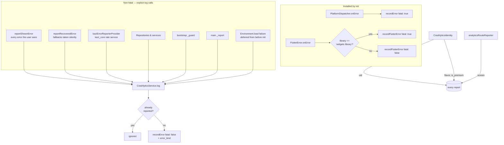

# Crashlytics

One question: **when this broke for a real user, what was the app doing and who
was it?** Analytics answers where people go; this answers what stopped them.

| | |
|---|---|
| Interface | [`CrashlyticsService`](../../domain/crashlytics_service.dart) — 4 methods |
| Implementation | [`firebase_crashlytics_service.dart`](firebase_crashlytics_service.dart) |
| Identity | [`crashlytics_identity.dart`](crashlytics_identity.dart) |
| Provider | `crashlyticsServiceProvider` (`keepAlive`) in [`injector.dart`](../../../../injector.dart) |
| Started | [`main.dart`](../../../../main.dart), first thing after Firebase |

---

## What reaches the dashboard

```mermaid
flowchart TD
    subgraph installed[Installed by init]
        PD[PlatformDispatcher.onError] --> RE1[recordError fatal: true]
        FE[FlutterError.onError] --> LIB{library ==<br/>'widgets library'?}
        LIB -->|yes| RFE1[recordFlutterError fatal: true]
        LIB -->|no| RFE2[recordFlutterError fatal: false]
    end

    subgraph handled[Non-fatal — explicit log calls]
        SHOWN[reportShownError<br/>every error the user sees]
        RECOVERED[reportRecoveredError<br/>fallbacks taken silently]
        CORE[kaziErrorReporterProvider<br/>kazi_core rate service]
        REPO[Repositories & services]
        GUARD[bootstrap _guard]
        REPORT[main _report]
        ENV[Environment.load failure<br/>deferred from before init]
    end

    SHOWN --> LOG[CrashlyticsService.log]
    RECOVERED --> LOG
    CORE --> LOG
    REPO --> LOG
    GUARD --> LOG
    REPORT --> LOG
    ENV --> LOG
    LOG --> SEEN{already<br/>reported?}
    SEEN -->|yes| SKIP[ignored]
    SEEN -->|no| RE2[recordError fatal: false<br/>+ error_kind]

    ID[CrashlyticsIdentity] -->|uid| STAMP[(every report)]
    ID -->|flavor, is_premium| STAMP
    RR[analyticsRouteReporter] -->|screen| STAMP
```

`init()` is awaited **before** anything else in `main()` for exactly one reason:
it is what reports a failure in everything after it. See [core/README.md](../../../README.md).

---

## Every error the user sees is reported, once

[`reportShownError`](../../../utils/shown_error_reporter.dart) runs for every
error put in front of the user: `BaseNotifier` calls it for every controller,
and the few widgets that show an error themselves call it directly. It reports
the same incident to Crashlytics and, as `error_shown`, to analytics.

**The root cause, not the wrapper.** A repository catches a
`FirebaseException`, logs it, and throws an `ExternalError` carrying it as
`cause` with the trace where it was caught. `reportShownError` follows the
`cause` chain to the innermost failure and reports *that*, with the deepest
trace. Reporting the wrapper would group every Firestore failure under one
issue, with a trace pointing at the controller.

**Once.** The repository has usually reported that same object already. `log`
remembers what it reported (an `Expando`, so nothing is retained) and ignores a
second report of the same instance. The repository keeps its own report
because several callers swallow its errors on purpose — the header counts, the
namesake check, the archived clients a service form only needs for a label —
and those would otherwise go unreported.

**Recovered failures are reported too.** A `catch` that takes a fallback
without telling the user calls `reportRecoveredError`, which, like
`reportShownError`, cannot throw — reading the Crashlytics provider inside the
`catch` that is saving the screen must not be what takes it down. kazi_core
has no crash reporter, so its exchange-rate service hands what it swallows to
`kaziErrorReporterProvider`, which `main.dart` points at `log`; kazi_companies
keeps the default, which discards. The one failure deliberately left out is a
`permission-denied` on the daily rates `putIfAbsent`: that is the rules
refusing a document another client already created, which is expected.

**Wrap with `cause:` and `trace:`.** An `ExternalError` thrown without them
reports the wrapper, and the analytics event loses its `cause`. A widget that
shows an error without calling `reportShownError` reaches neither destination.

| Stamp | Set by | Value |
|---|---|---|
| `error_kind` | `log`, on every report | `business_rule` (a `ClientError`), `unexpected` (an `Error` — a bug), `external` (any other `Exception`) |
| `screen` | `analyticsRouteReporter`, on every navigation | The `AppPage` name, so a report from deep in a repository still says where the person was |
| reason | `reportShownError` | `ExternalError shown by DashboardController on home` |

Filter on `error_kind = business_rule` to set aside refusals the app meant to
make — a repeated document, a missing field — from failures. They are reported
because a spike in one is still a finding (a confusing form), but on Android
Crashlytics keeps only the last eight non-fatals per session, so they compete
for room with real failures.

---

## Collection is off in debug

`FirebaseCrashlyticsService` takes `isCollectionEnabled`, defaulting to
`!kDebugMode`. Two consequences, and the second is the one that bites:

- A crash on a developer's machine never reaches the dashboard. `prod` and
  `prod_test` share **one Firebase project**, so there is no separate bucket it
  could have landed in.
- When collection is off, `init()` **returns without touching**
  `FlutterError.onError` or `PlatformDispatcher.onError`. Overriding them would
  hand every debug error to a disabled collector, which drops it — and the
  console output is the entire point of a debug run. Leaving Flutter's own
  handlers in place is deliberate, not an oversight.

Pass the flag explicitly to test either branch.

---

## Every report carries who and which build

[`CrashlyticsIdentity`](crashlytics_identity.dart) is a `keepAlive` controller
started first in the bootstrap — before the ads SDK, before Remote Config —
because a crash in any of those steps should already be attributable.

| Stamp | Value | Why |
|---|---|---|
| User id | Firebase Auth uid, cleared on sign-out | Same id analytics uses as `distinctId`, so a crash and a funnel drop-off match to one person |
| `flavor` | `staging` / `prod` / `prod_test` | `prod` and `prod_test` report into the same project; without this an internal build's crash looks like a user's |
| `is_premium` | bool | Separates the paying cohort's crashes from the ad-serving code paths |

It is kept **separate from `AnalyticsIdentityController`** despite the overlap:
that one describes cohorts and is gated behind the user's analytics consent,
this one is diagnostic and is not.

---

## Only widget-tree errors are fatal

`FlutterError.onError` catches what the framework reports — an exception in
`build`, an image that failed to load, a layout error — and the app keeps
running in every case. Which of them is *fatal* is therefore a severity choice,
and on Android it is not just a label:

| | Fatal (`logFatalException`) | Non-fatal (`recordException`) |
|---|---|---|
| Analytics `app_exception` | Logged, every time | Not logged |
| Crashlytics session | Closed and reopened, as for a real crash | Untouched |
| Report upload | Rate-limited queue; overflow is **dropped** | Sent with the session |
| Crash-free users | Counts against it | Does not |

So the split is by `FlutterErrorDetails.library`:

| `library` | Covers | Reported as |
|---|---|---|
| `'widgets library'` | `build` failures (an `ErrorWidget` — a grey screen in release — where the UI should be), and exceptions in app callbacks the widgets layer invokes, such as `WidgetsBindingObserver` | **Fatal** |
| anything else | `image resource service`, `rendering library` (layout), `gesture library`, `services library`, … | Non-fatal |

When every framework error was fatal, a `NetworkImage` with no error handler on
the settings page produced 422 `app_exception` from 103 users in a week, against
8 fatal reports in the dashboard (2.0.0–2.0.1, fixed in 2.0.2). The crash-free
metric — computed from `app_exception` — was measuring that avatar, not
crashes.

The cost runs the other way too: a `build` exception that repeats on every
rebuild still logs one `app_exception` per occurrence and still has its
overflow dropped. That is accepted, because a broken screen is what the crash
metric should react to. Image and layout errors land in the non-fatal list,
which therefore needs watching for `FlutterError` issues.

`PlatformDispatcher.onError` — an uncaught asynchronous error — stays fatal: it
does not stop the app either, but it means a flow died midway (a save that never
completed), which is rare and serious.

The label is a string Flutter sets, not an API contract; the service test pins
the behaviour, so an SDK upgrade that renames it fails there first.

---

## The startup window nothing could report

Crashlytics needs Firebase; Firebase needs the environment. Anything failing
before `init()` therefore has no reporter yet. Two halves:

- **`Environment.load()`** — its failure is *captured and deferred*, not thrown.
  The app runs without dotenv (every key resolves to empty), so it continues
  degraded and `main()` reports the error as soon as Crashlytics is up.
- **`FirebaseWrapper.initialize()`** — genuinely unreportable. If Firebase does
  not come up there is no Crashlytics to receive the error, native or Dart. It
  still rethrows, and that startup crash is invisible by construction.

Everything after `init()` in `main()` runs through `_report`, the pre-splash
twin of the bootstrap's `_guard`.

---

## Symbols

| | Status |
|---|---|
| iOS dSYMs | Uploaded automatically — `flutterfire upload-crashlytics-symbols` build phase in the Xcode project |
| Android mapping | Uploaded by the `com.google.firebase.crashlytics` Gradle plugin |
| Android NDK | **Not enabled**, on purpose |

`nativeSymbolUploadEnabled` is deliberately off: this app ships no native code
of its own, and `libflutter.so` symbols come from Flutter's own symbol server,
not from an upload we control. It would add build time and upload nothing
useful.

What *would* break readable stack traces is Dart obfuscation — and the class
names `reportShownError` sends as `code`, `origin` and `cause`, which come from
`runtimeType`. Builds are made
manually today with no `--obfuscate`/`--split-debug-info`, so Dart frames arrive
readable. If that ever changes, the symbol file must be kept per release and the
traces run through `flutter symbolize` — the Crashlytics plugin does not handle
Dart symbols.
