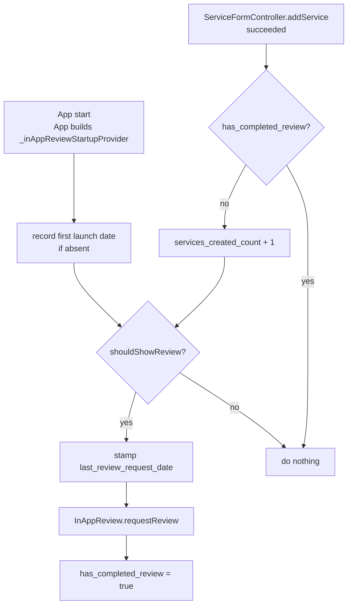

# Store review prompt

The native store-review sheet (Play In-App Review / `SKStoreReviewController`),
asked for at most **once per install**, and only from a user who has enough of
the app behind them to have an opinion.

## The rules

All four must hold at the moment of the check:

| Rule | Value | Storage key |
|---|---|---|
| Services created | **≥ 20** | `services_created_count` |
| Days since first launch | ≥ 2 | `first_app_launch_date` |
| Days since the last request | ≥ 2 | `last_review_request_date` |
| Never requested before | — | `has_completed_review` |

They are constants in [`kazi_in_app_review_manager.dart`](kazi_in_app_review_manager.dart);
there is no Remote Config override.

## When it is checked

So a user who has already passed 20 services gets the prompt on the *next*
service they create; a user who was already eligible but had the app closed gets
it on the next launch.

## Things that are not what they look like

- **"Services created" is creation *actions*, not rows.** `addService` can write
  several services at once (the form's quantity field), and the counter is
  incremented once per call. Twenty saves of quantity 5 count as twenty, not a
  hundred.
- **The count is local and starts at zero.** It is a local-storage counter, not
  a query against Firestore. A user who already had hundreds of services before
  this shipped starts from zero and needs 20 more.
- **Sign-out resets everything.** `sign_out_dialog.dart` calls
  `storage.clear()`, which wipes all four keys — including
  `has_completed_review`. A user who signs out and back in can be asked again,
  after re-earning the 20 services.
- **"Completed" means "asked", not "reviewed".** Neither platform tells the app
  whether the sheet appeared or whether a review was written, and both apply
  their own quota on top (iOS caps at three prompts a year; Play returns
  silently when its quota is spent). `requestReview()` swallows its own errors,
  so a failed request still sets the flag and burns the one attempt.
- **`_daysBetweenReviewRequests` is close to dead.** With `has_completed_review`
  checked first, a second request can never happen within one install. It stays
  as the guard that would matter if the completed flag were ever relaxed.

## Wiring

| Piece | Where |
|---|---|
| Rules | `KaziInAppReviewManager` (this folder) |
| Platform call | `KaziInAppReviewServiceImpl` → `in_app_review` package |
| Provider | `inAppReviewManagerProvider` in [`kazi_providers.dart`](../../../kazi_providers.dart) |
| App-start trigger | `_inAppReviewStartupProvider` in `kazi/lib/app.dart` |
| Creation trigger | `ServiceFormController.addService` |
| Keys | [`KaziStorageKeys`](../../constants/kazi_storage_keys.dart) |

## Changing the threshold

One constant, `_minServicesCreated`. The tests in
[`kazi_in_app_review_manager_test.dart`](../../../../test/shared/services/in_app_review/kazi_in_app_review_manager_test.dart)
assert the boundary explicitly (19 stays silent, 20 fires), so they will point
at the number if it moves.
